# 📊 Stock Fluctuation Analysis Agent (Google ADK)

This project implements an AI agent workflow using the Google Agent Development Kit (ADK) to analyze reasons behind stock price fluctuations for a user-specified ticker and week.

## 🧠 Purpose

The primary goal is to provide users with insights into why a particular stock's price may have changed during a specific week by leveraging information from news articles and financial data.

## 🏗️ Architecture

The system uses a Supervisor-Sub-agent architecture:

*   **Supervisor Agent (`SupervisorAgent`)**:
    *   Manages the overall workflow and user interaction.
    *   Orchestrates calls to specialized sub-agents.
    *   Synthesizes information for the user.

*   **Sub-Agents**:
    1.  **TickerValidationAgent**:
        *   Validates the user-provided stock ticker using the Yahoo Finance API (`yfinance`).
    2.  **NewsRetrievalAgent**:
        *   Fetches relevant news articles for the specified ticker and week using the DuckDuckGo Search API.
    3.  **FinancialSummaryAgent** (Optional - Not yet implemented):
        *   Intended to gather financial statements or summaries.
    4.  **SentimentAnalysisAgent** (Optional - Not yet implemented):
        *   Intended to analyze the sentiment of news articles.

## 🛠️ Tech Stack

*   **Framework**: Google Agent Development Kit (ADK)
*   **LLM**: Gemini Pro (via ADK defaults)
*   **APIs**:
    *   Yahoo Finance API (via `yfinance` library)
    *   DuckDuckGo Search API (via `duckduckgo-search` library)
*   **Programming Language**: Python 3.10+
*   **Key ADK Components**: `LlmAgent`, `AgentState` (implicitly via agent logic, formal graph not yet primary focus).

## 🚀 Getting Started

### 1. Prerequisites

*   Python 3.10 or higher.
*   Access to Google Cloud and an API key for Gemini LLM services.

### 2. Setup

1.  **Clone the repository (or ensure you have this `qa_system_finance` folder).**

2.  **Navigate to the project directory:**
    ```bash
    cd path/to/your/agents/qa_system_finance
    ```
    (Or from the root of the main repo: `cd agents/qa_system_finance`)

3.  **Create a virtual environment (recommended):**
    ```bash
    python -m venv .venv
    source .venv/bin/activate  # On Windows: .venv\Scripts\activate
    ```

4.  **Install dependencies:**
    ```bash
    pip install -e .
    ```
    (The `-e .` installs the project in editable mode, including dependencies from `pyproject.toml`)
    Alternatively, `pip install -r requirements.txt` if you generate one, but `pyproject.toml` is standard.

5.  **Set up environment variables:**
    You need to set your Google API key for the LLM. Create a `.env` file in the `agents/qa_system_finance` directory or set it directly in your environment:
    ```
    GOOGLE_API_KEY="YOUR_GEMINI_API_KEY"
    ```
    The application uses `python-dotenv` to load this if the file exists.

### 3. Running the Agent

Once the setup is complete, run the main application from within the `agents/qa_system_finance` directory:

```bash
python main.py
```

You will be prompted to enter a stock ticker and then the week you are interested in.

## 🔄 Workflow Overview

```mermaid
graph TD
  User[👤 User] -->|Interact| Supervisor(🤖 SupervisorAgent)
  Supervisor -->|Validate Ticker| ValidationAgent(🔎 TickerValidationAgent)
  ValidationAgent -->|Validation Result| Supervisor
  Supervisor -->|Get News| NewsAgent(📰 NewsRetrievalAgent)
  NewsAgent -->|News Articles| Supervisor
  Supervisor -->|Present Information| User
```


*(Note: FinancialSummaryAgent and SentimentAnalysisAgent are planned optional additions.)*

## 📝 TODO / Future Enhancements

*   Implement `FinancialSummaryAgent`.
*   Implement `SentimentAnalysisAgent`.
*   Improve natural language understanding for week input in `SupervisorAgent`.
*   Use ADK `Graph` for a more formal workflow definition.
*   Add more robust error handling and logging.
*   Develop comprehensive unit and integration tests.
*   Allow for continuous conversation rather than resetting after each query.
